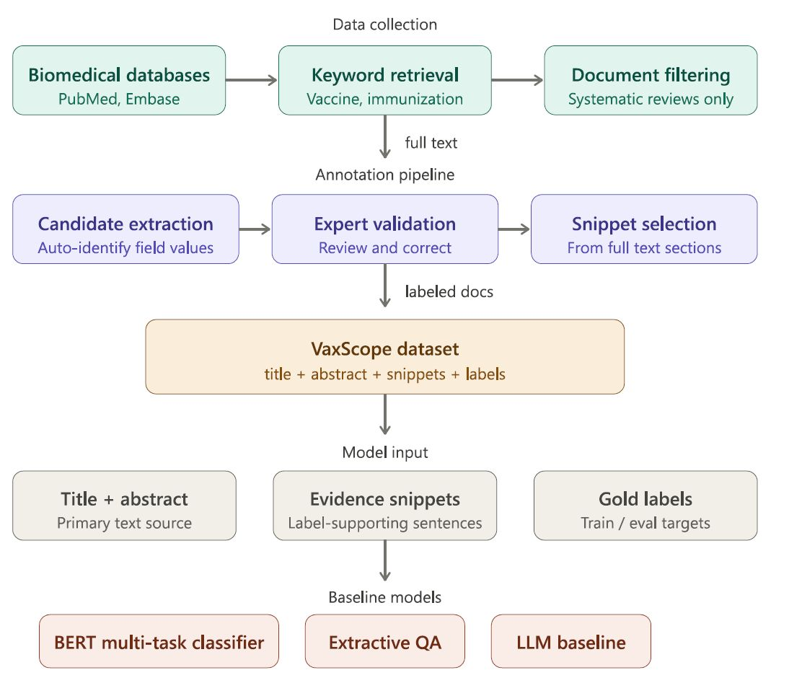

## **VaxScope: Document-Level Structured Evidence Extraction from Immunization Systematic Reviews**

Accepted at **BioNLP 2026 (ACL 2026), San Diego, CA**.

---

## Overview

VaxScope is a benchmark dataset for document-level structured evidence extraction from immunization-related systematic reviews. It targets review-level attributes such as disease, population, outcome, study design, review type, number of included studies, number of participants, and date of last literature search.

Unlike span-level extraction datasets, VaxScope focuses on normalized document-level labels supported by evidence snippets from systematic reviews.

<p align="center">
  
</p>

<p align="center">
  Overview of the VaxScope corpus construction and annotation workflow.
</p>

## What is included

- Document-level annotation schema
- Evidence-grounded structured labels
- Benchmark splits for model development and evaluation
- Baseline code for multi-task transformer classification
- Slot-filling baselines for numeric and temporal fields

## Dataset

The dataset contains immunization-related systematic reviews annotated with structured document-level attributes, including:

- disease
- population
- topic
- outcome
- study type
- review type
- number of included studies
- number of participants
- date of last literature search
- supporting evidence snippets

## Baselines

The paper reports transformer-based baselines using:

- Bio_ClinicalBERT
- PubMedBERT
- Clinical-Longformer

The best-performing model is PubMedBERT with evidence snippets, reaching an average F1 score of 0.850 on the held-out expert gold test set.

## Citation

If you use VaxScope, please cite:

```bibtex
@inproceedings{ilgen-etal-2026-vaxscope,
    title = "{V}ax{S}cope: Document-Level Structured Evidence Extraction from Immunization Systematic Reviews",
    author = "Ilgen, Bahar and Awotoro, Ebenezer and Hattab, Georges",
    booktitle = "{B}io{NLP} 2026",
    year = "2026",
    pages = "853--863",
    publisher = "Association for Computational Linguistics",
    doi = "10.18653/v1/2026.bionlp-1.69",
    url = "https://aclanthology.org/2026.bionlp-1.69/"
}
